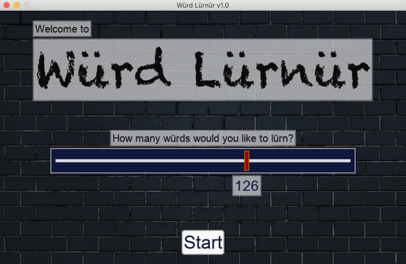
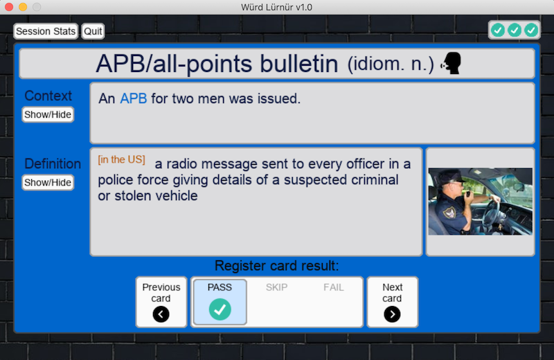
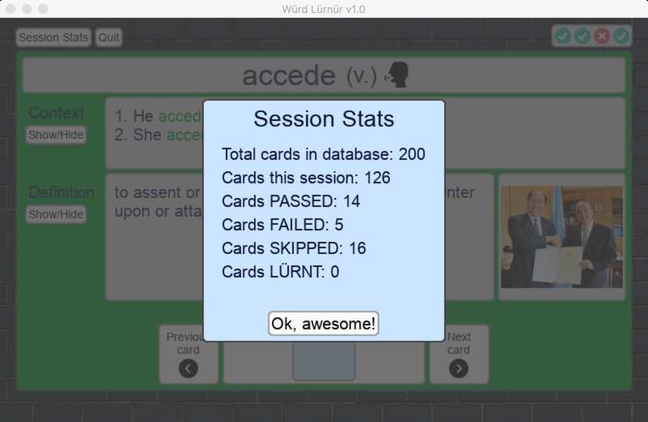
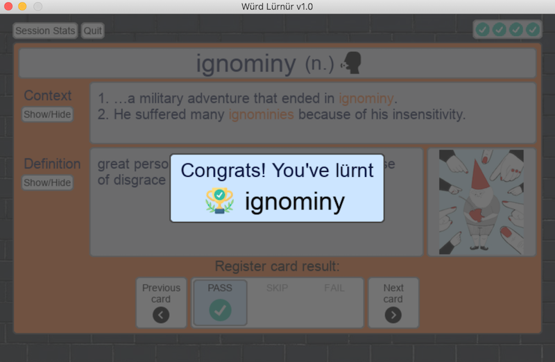

# Würd Lürnür

__Würd Lürnür__ simulates a flashcard rote-learning environment for a given database of words. The program opens a local .csv file and uses Python's [Pygame](https://www.pygame.org/) and [Pandas](https://pandas.pydata.org/) libraries for graphics/SFX and database manipulation, respectively.

The User starts a new Session by selecting the number of words to be added. Each word is then displayed to the User in the form of a flashcard, containing the word's part of speech, context (example sentences), definition, and image. The User selects whether they 'failed' or 'passed' the given card (a 'skip' option is also available), and with each card change the database is updated. A word is deemed *lürnt* once 5 passes have been registered, at which point it is excluded in any subsequent executions of the program.

A sample database of 200 words is included with the code and for each word the following information is displayed:
* part of speech
* context (i.e. example sentences)
* definition (mostly sourced from the OED)
* image (from various sources)
* sample session history with past results

Word pronunciations are also available, however only the first 10 pronunciations have been included due to GitHub's size constraints.

Stable on Python 3.9.1, Pandas 1.2.1 and Pygame 2.0.1.
<br/><br/>

## Getting Started

1) Download all files and folders.

2) Install any missing modules (e.g. Pandas, Python).

3) Run __Würd Lürnür__ as a script directly from your machine's shell and you're good to go!
<br/><br/>

Optional: pass ```chron```, ```alpha```, or ```rand``` as an additional argument to order cards chronologically, alphabetically, or to randomize (default).

```
python wurd_lurnur.py chron
```


<br/>

## Version

1.0
<br/><br/>

## License

__Würd Lürnür__ is licensed under the MIT License - see the [LICENSE](LICENSE.md) file for details. Any comments, suggestions, and forks welcome.

All word images included are for demonstrative purposes only.
<br/><br/>

## Acknowledgments

Big thank you to everyone who has helped move this thing along:

* [Adam Wiraszka](https://github.com/wiraszka "Adam's Github page") for sharing some invaluable Pandas wisdom;
* [Juan Moreno](https://github.com/juansolu "Juan's Github page") for various project style & formatting recommendations; and of course
* [My best friend in these difficult times](https://www.amazon.ca/Lavazza-Espresso-Crema-Gusto-Coffee/dp/B0769XQ54M/ref=sr_1_8?dchild=1&keywords=lavazza+coffee&qid=1612121705&sr=8-8 "Pure bliss").

<br/><br/>










